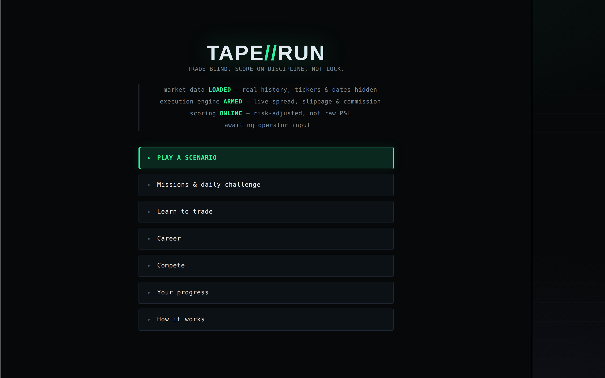
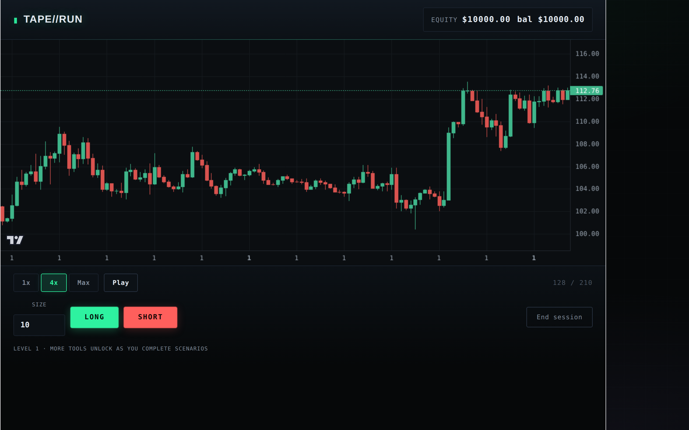
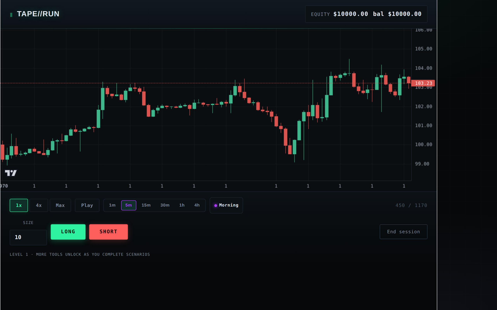
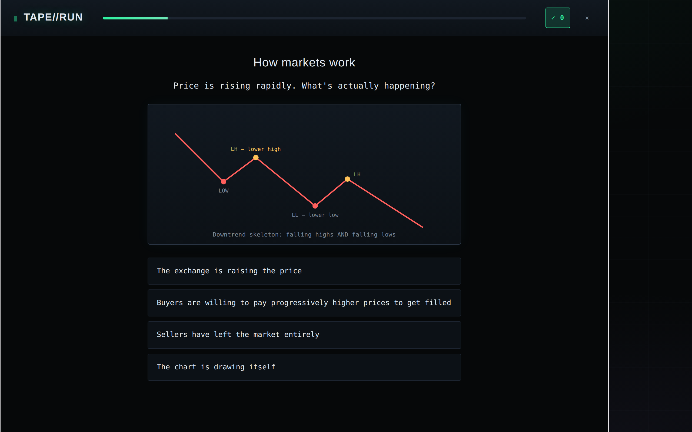
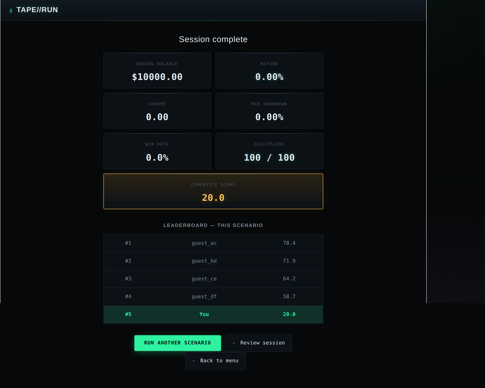
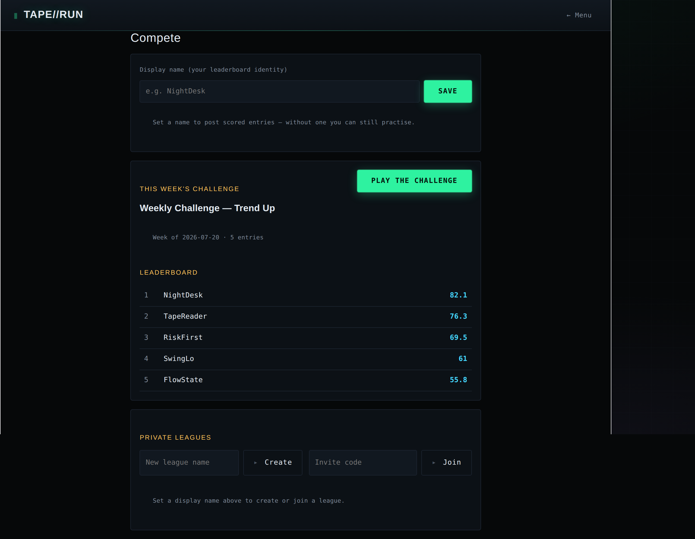
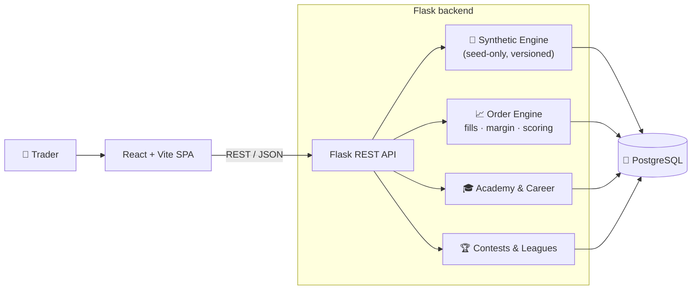
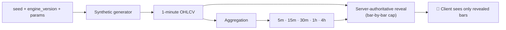

# TAPE//RUN

### A trading simulator powered by a statistically validated synthetic market engine

*Trade blind, unpredictable, reproducible markets — and get scored on discipline, not luck.*

---

### At a glance

- 🧠 **Synthetic market engine** — regimes, volatility clustering and fat tails, statistically validated in CI
- 📈 **Server-authoritative simulator** — order engine with spread, slippage, leverage, margin and liquidation
- 🎓 **Duolingo-style academy** — 20 lessons, 125 questions, 24 hand-drawn SVG diagrams
- 🏆 **Weekly contests & private leagues** — everyone trades the same seed, revealed bar by bar
- 📊 **Post-session analytics & A/B/C setup grading** — expectancy, profit factor, structure, coaching
- ⚡ **Zero market-API dependency** — the engine has no numerical third-party dependencies and needs no live data feed

---

## Why this is different

Most replay simulators loop a finite library of historical charts. TAPE//RUN generates its markets.

| | |
|---|---|
| 🚫 **No external market APIs** | Bars are generated in-process — no data vendor, no rate limits, no outages |
| ♾️ **Unlimited deterministic scenarios** | A seed + an engine version reproduce a market exactly, forever |
| 🔬 **Statistically validated realism** | Fat tails, volatility clustering and no raw-return predictability are enforced by the test suite |
| 🕳️ **Zero future-data leakage** | The client never holds a seed or an unrevealed bar |
| 🛰️ **Fully server-authoritative** | Fills, scoring and reveal are computed on the backend |
| 🏷️ **Versioned simulation engine** | Old scenarios keep generating against the engine version that minted them |

---

## Screenshots

**Main menu — trade blind, score on discipline**

**Simulator — a synthetic scenario mid-playback**

**Multi-timeframe intraday — switch 1m / 5m / 15m / 30m / 1h / 4h, with a live session indicator**

**Academy — teach → question, with a diagram for every idea**

**Results — risk-adjusted score, not raw P&L**

**Compete — weekly challenge leaderboard and private leagues**

> All screenshots use synthetic scenarios. Real-market replays (when configured) are shown blind — no tickers, no dates — to keep the read honest.

---

## System architecture

### Data pipeline — from a seed to revealed candles

Bars are never stored for generated scenarios. Given the same seed, engine version and parameters, the pipeline reproduces an identical market on demand.

---

## Synthetic market engine

The engine is standard-library Python — no NumPy, no data vendor. Each layer exists for a reason.

### 🎲 Regime model
A Markov chain moves the market between five regimes — `trend_up`, `trend_down`, `range`, `high_vol`, `low_vol` — with persistent durations and smooth (blended) transitions rather than hard snaps.
**Purpose:** real markets trend, chop and calm down in stretches; a single fixed process never feels like a real chart.

### 🌊 Volatility model
Conditional variance follows a `GARCH(1,1)` process, with an additional slow expansion/compression cycle layered on top.
**Purpose:** calm periods naturally build into turbulence and back — volatility clusters, exactly as it does in real markets.

### 📉 Fat tails
Innovations are drawn from a standardized Student-t distribution instead of a Gaussian.
**Purpose:** real markets produce outsized moves far more often than a bell curve allows; Gaussian returns badly under-price tail risk.

### 🏗 Structure layer
The generator remembers recent swing highs and lows, and occasionally runs liquidity **sweeps** (a wick pokes past an obvious level, then closes back) and **failed breakouts**.
**Purpose:** price respects and hunts structure — the behaviour a discretionary trader is actually reading.

### 📊 Volume engine
Volume is quiet in compression and spikes on wide-range and breakout bars.
**Purpose:** volume should confirm or contradict a move, so it has to correlate with range (CI-checked, mean correlation > 0.3).

### 🕯 Pattern formation
Dojis, pin bars and engulfing candles are **not** scripted — they emerge from the body/wick model and are verified to occur within realistic bands.
**Purpose:** patterns a trader recognises should arise naturally, not be painted on.

### ✅ Statistical validation
A CI suite gates the realism bar on every change. Guaranteed properties include:

| Property | Acceptance gate | Representative measurement |
|---|---|---|
| Fat tails | excess kurtosis > 1 | ≈ 10+ |
| Volatility clustering | mean \|returns\| autocorrelation (lags 1–5) > 0.10 | ≈ 0.32 |
| No free edge | max raw-return autocorrelation (lags 1–5) < 0.10 | ≈ 0.00 |
| Seed independence | cross-seed \|correlation\| < 0.15 | — |
| Volume realism | volume↔range correlation > 0.3 | — |

The "no free edge" gate is the important one: raw returns are **not** autocorrelated, so there is no trivial pattern to exploit — skill has to come from risk and timing, not from a leak in the generator.

---

## Seed-only architecture

> **Every scenario is generated from nothing more than a seed and an engine version — unlimited markets at effectively zero storage cost.**

A generated scenario persists only its seed, parameters and `engine_version`; its bars are regenerated deterministically on read and cached in memory. Because each scenario is pinned to the engine version that minted it, evolving the generator never silently rewrites an existing market — critical for reproducible, in-flight contests where everyone must trade the identical tape.

---

## 🛡 Anti-cheat & integrity

The whole point of a blind simulator is that you cannot see the future. That is enforced on the server, not asked of the client.

**Reveal & execution**
- ⏱️ Bars are revealed incrementally; the server tracks a high-water mark per session
- 🙈 The client never receives a seed, the engine parameters, or any unrevealed bar
- 🖥️ Order fills, liquidation and scoring are computed entirely server-side
- 🎯 Contests share one seed across all players, and the reveal cap makes grabbing the future impossible — future bars simply do not exist to a contestant yet

> Identity is a lightweight guest model (no accounts, passwords, or personal data). Competitive integrity comes from server-authoritative reveal and scoring, not from a login wall.

---

## 🎮 Gameplay systems

**Order engine.** Market, limit and stop orders with configurable stop-loss, take-profit and trailing stops. Every fill applies a per-asset-class spread, slippage and commission model, processed bar by bar.

**Leverage, margin & liquidation.** Positions can be leveraged; the engine tracks margin and liquidates a blown account. A blown account scores **zero** — and a post-mortem shows how a disciplined version of the same session would have ended.

**Risk-adjusted scoring.** The composite score blends a Sharpe-like ratio, return, max drawdown and win rate with a discipline sub-score. Discipline is centred and weighted so that a **lucky, oversized punt scores below a disciplined sequence of smaller trades** — the core design principle. A blown account overrides everything with a zero.

**Skill-gated career.** Seven career levels unlock markets and tools as you demonstrate risk control (defined-risk trades, drawdown limits, mission completions) — progression is earned by process, not by paper profit.

---

## 🎓 Academy

A self-contained, Duolingo-style course: short **teach → question** steps with a diagram for nearly every concept, plus knowledge checks and an inline glossary. Lesson progress unlocks in sequence, and a separate XP/rank ladder runs alongside the trading career.

- **20** lessons · **125** questions · **24** hand-drawn SVG diagrams · **54** glossary terms · **7** XP ranks

---

## 📈 By the numbers

| Metric | Value |
|---|---|
| Academy lessons | 20 |
| Practice questions | 125 |
| SVG concept diagrams | 24 |
| Glossary terms | 54 |
| Career levels | 7 |
| XP ranks | 7 |
| Market regimes | 5 |
| Asset personalities | 5 (crypto · forex · indices · commodities · stocks) |
| Chart timeframes | 6 (1m → 4h) |
| Synthetic scenarios | unlimited |
| Numerical dependencies in the engine | 0 |
| Backend automated tests | 125 |

---

## Traditional replay sim vs TAPE//RUN

| | Traditional replay sim | TAPE//RUN |
|---|---|---|
| Market source | Historical replay only | Unlimited generated markets |
| Scenario count | Finite library | Effectively infinite |
| Data dependency | Live/vendor API | Self-generating, offline |
| Reproducibility | Depends on stored data | Exact from a seed + engine version |
| Future leakage | Possible (client holds the series) | Server-authoritative reveal |
| What it trains | Recognising specific past charts | Decisions under genuine uncertainty |

TAPE//RUN is a skill-building trainer. It makes no claim about trading performance or outcomes — the goal is transferable decision-making under uncertainty, not returns.

---

## 🔧 Engineering challenges

- **Designing statistically realistic markets** — combining regime switching, GARCH volatility and fat tails into a series that passes quantitative acceptance tests, with only the standard library.
- **Eliminating future-data leakage** — a reveal architecture where the client provably cannot see, derive or reconstruct an unrevealed bar.
- **Infinite generation with reproducibility** — unlimited markets that are byte-for-byte reproducible from a seed at near-zero storage cost.
- **Deterministic engine versioning** — evolving the generator without ever altering markets already minted (and possibly mid-contest).
- **Server-authoritative execution** — fills, margin, liquidation and scoring computed on the backend so the score reflects the rules, not the client.

---

## 🗺 Roadmap

**Shipped and live**
- ✅ Core realism engine — Markov regimes, GARCH volatility, fat tails, structure layer
- ✅ Rule-0 pre-playback history, seed-only scenarios, deterministic engine versioning
- ✅ Multi-timeframe intraday (1m base, aggregated up, no-leak reveal on every timeframe)
- ✅ Server-side market-structure metadata (swings, levels, sweeps, failed breakouts)
- ✅ Intraday trading sessions + scheduled-news toggle
- ✅ A/B/C setup grading from confluence
- ✅ Asset personalities + correlated benchmark overlay
- ✅ Post-session performance analytics (expectancy, profit factor, payoff, drawdown)

**Explicitly deferred**
- ◯ Adaptive AI difficulty
- ◯ Expanded LLM coaching beyond the current flag-gated review

---

## 🌍 Vision

TAPE//RUN sits between educational simulators that loop the same historical charts and the professional environments those charts came from. Instead of memorising the past, a trader practises against markets that are **unlimited, unpredictable, reproducible and fair** — building the transferable, decision-under-uncertainty skill that a fixed replay library can never teach.

---

Frontend repository: <a href="https://github.com/alastairdeanthony403-wq/trading-sim-frontend">trading-sim-frontend</a> · React + Vite client for this API.

